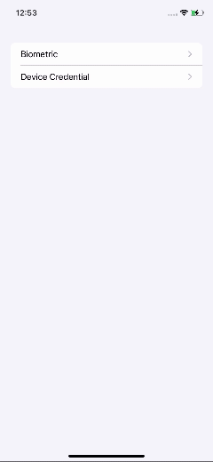
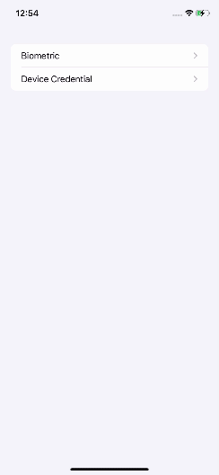
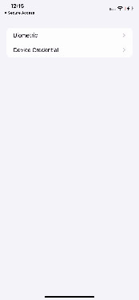

# WebAuthn Demo Swift

## Introduction

WebAuthn Demo Swift is a sample application that exemplifies the seamless
integration and powerful utilization of [webauthn-swift](https://github.com/line/webauthn-swift)
within iOS and macOS environments. It offers practical examples of implementing
secure and password-less authentication using biometric and device credential
authenticators.

## Features

- Demonstrate the use of `Biometric` and `DeviceCredential`.
- Include the example of registering and authenticating a credential.
- Provide the example implementation of relying party and credential source
storage using SQLite.

## Requirements

- Swift >= 5.9
- Xcode >= 15.4

## Getting Started

To get started with the `webauthndemo-swift`, follow these steps:

### 1. Clone the git repositories.
To clone both the `webauthn-swift` and `webauthndemo-swift` repositories, follow
the step:

```
$ git clone https://github.com/line/webauthn-swift.git
$ git clone https://github.com/line/webauthndemo-swift.git
```

### 2. Add `webauthn-swift` package dependency.

1. Open `webauthndemo-swift` project in Xcode.
3. Click `Package Dependencies`.
4. Click `+` button.
5. Click `Add Local...` button.
5. Find `webauthn-swift` repository and click `Add Package` button.
6. Click `Add Package` button.

You can finally see that the `webauthn-swift` package has been added in
`swiftpm/Package.resolved`.

### 3. Launch a WebAuthn server.

We use the FIDO2 server [here](https://github.com/line/line-fido2-server) to run
the sample application. Please refer to the [README](https://github.com/line/line-fido2-server/blob/main/README.md#how-to-run)
for instructions on how to run the server.


### 4. Change the domain of relying party in [`Endpoint.swift`](./Shared/Authn/Network/Endpoint.swift).

The current domain is set to `"example.com"`. Please replace this value with the
server domain you want to test.

## Usage

- Click on the authenticator you want to test, either `Biometric` or
`Device Credential`.
- Once you have selected the authenticator, you will see five buttons: `Sign Up`,
`Sign In`, `Show`, `Delete`, and `Delete All`.
    - `Sign Up`: Users sign up as members when registering credentials.
    - `Sign In`: Users sign in when authenticating credentials.
    - `Show`: It shows the users registered so far.
    - `Delete`: It deletes all users registered in the authenticator currently
    being tested.
    - `Delete All`: It deletes all registered users from all authenticators.
- The box at the bottom with a green solid line shows errors that occur during
execution.

## Screenshots

### Biometric authenticator



### Device credential authenticator



### Device credential authenticator if biometric fails



## Contact Information

We are committed to open-sourcing our work to support your use cases. We want to
know how you use this library and what problems it helps you to solve. For
communication, we encourage you to use the [Issues](https://github.com/line/webauthndemo-swift/issues)
section of our GitHub repository to report issues, suggest enhancements, or ask
questions about the library. This will help us to address your concerns more
efficiently and allow the community to benefit from your input.

Please refrain from posting any sensitive or confidential information in the
issues. If you need to discuss something sensitive, please mention that in your
issue, and we will find a more secure way to communicate.